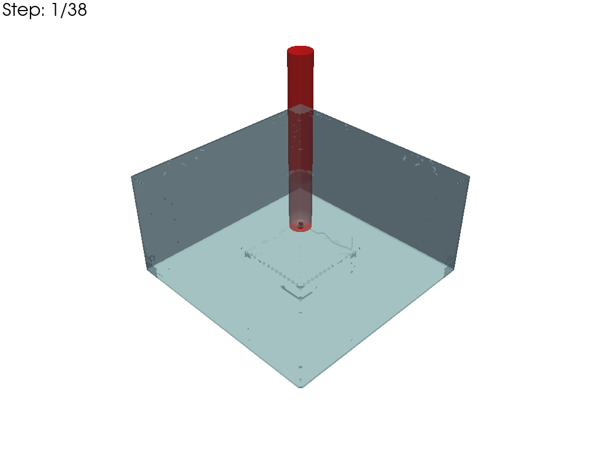
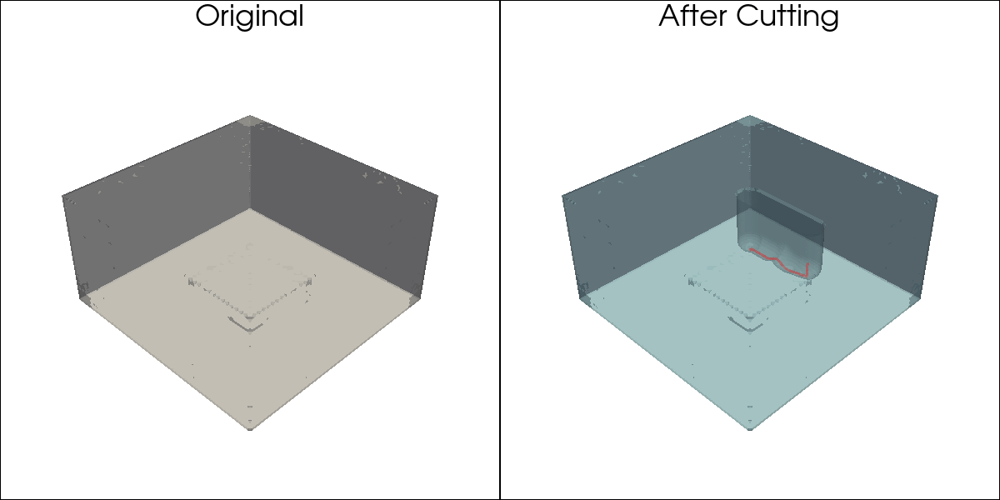

## Getting Started
This project uses the [uv](https://docs.astral.sh/uv/) Python package and project manager.  Please install uv first if you haven't already.

1. Clone the repository
2. Install dependencies: `uv sync`
3. Run the example: `uv run simulate.py`

| Cutting process animation | Before vs after |
| --- | --- |
|  |  |

## Todo
- [ ] Correct mesh rendering in animation output
